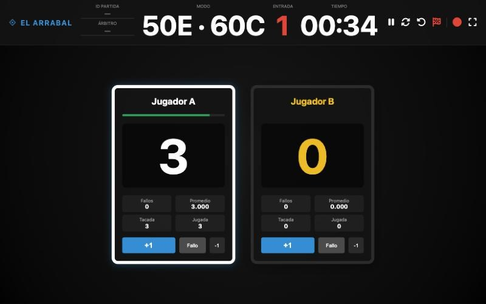

Hay un tipo de problema que veo mucho en negocios y asociaciones pequeñas: alguien hizo una aplicación, funcionaba "más o menos"... y un día esa persona deja de estar. La herramienta se queda a medias, nadie sabe tocarla y el equipo acaba volviendo al papel.

Eso es lo que pasaba en el **Billar El Arrabal**, el billar del centro de jubilados de Fuensalida. Te cuento qué hicimos, porque es un caso muy parecido al de muchas PyMEs de la zona con un programa hecho a medida que nadie mantiene.

## El punto de partida: una app que hacía la mitad del trabajo

El billar tenía una aplicación para llevar las partidas. La había hecho otro desarrollador que ya no la mantenía, y tenía fallos importantes:

- **Grababa solo el vídeo.** En la grabación no quedaban ni las puntuaciones ni la configuración de la partida.
- **Se quedaba sin memoria** y no terminaba nunca de grabar. Era un problema de la propia aplicación, no del ordenador.
- No se podía sincronizar en la nube ni subir las partidas a YouTube.

Así que la app les quitaba el lápiz y el papel... pero solo a medias. Pedro, que lleva el billar, tenía que ir arreglando a mano lo que la aplicación hacía mal. Y además usaba **tres o cuatro herramientas distintas** para todo lo demás, más alguna hoja de papel.

Es como tener un marcador electrónico que se apaga en mitad del partido: al final alguien apunta el resultado en una servilleta "por si acaso".

## Qué hice

La aplicación estaba hecha en Python. Yo no soy desarrollador de Python, y aquí está la parte interesante: la retomé con **Claude Code**, una herramienta de inteligencia artificial para programar, y con ella pude entender el código, ordenarlo y arreglarlo sin empezar de cero.

El trabajo fue, sobre todo, de orden:

1. **Estructurar el código** para que se pudiera mantener.
2. **Quitar todo lo que no se usaba.** Menos piezas, menos cosas que se pueden romper.
3. **Probar con quien la usa.** Hicimos varias sesiones de prueba en persona con Pedro en el billar, siguiendo sus indicaciones, hasta que la aplicación quedó lo bastante simple para que cualquiera del centro pudiera usarla sin ayuda.

Hoy la aplicación es un marcador sencillo para las partidas de carambola: puntos, entradas, promedio y un tiempo por turno con una barra que se va vaciando mientras el jugador piensa. Nada más... y nada menos.

*El marcador durante una partida de prueba.*

La IA me ahorró mucho tiempo en la parte técnica. Pero lo que hizo que la app funcionara de verdad fueron esas sesiones sentado al lado de quien la iba a usar... eso no lo sustituye ninguna herramienta.

## Qué ha cambiado

No tengo cifras que darte, y no me las voy a inventar. Lo que sí puedo contarte es lo que dice Pedro y lo que se ve.

> "Me gusta mucho la barra de tiempo que va mostrando."
>
> "Así de simple, la app la pueden usar todos."
>
> — Pedro, Billar El Arrabal

Y en el día a día:

- **Donde antes había tres o cuatro herramientas y papel, ahora se abre una aplicación y está todo ahí.**
- Y la mejor señal: **ahora me piden funciones nuevas** para meterlas en la aplicación. Cuando un equipo pasa de sufrir una herramienta a pedirle cosas, es que la herramienta ya forma parte de su día a día.

Tener todo centralizado le da a Pedro una gestión mucho más sencilla. Y a mí me confirma algo que llevo viendo 18 años: la mayoría de los problemas no se arreglan añadiendo otra herramienta, sino juntando las que ya hay.

## La decisión más importante: decir que no a una parte

Una vez que la app funcionó, llegaron las peticiones. Una de ellas era que la aplicación gestionara también a las personas: jugadores, ligas, torneos... Pedro lleva la liga con otra aplicación del móvil y luego la imprime en papel, y es lógico que quisiera tenerlo todo en el mismo sitio.

Aquí fui claro: **una cosa es una aplicación que gestiona una partida y otra muy distinta, una que gestiona personas.** La segunda se complica muchísimo, se vuelve muy específica y es mucho más difícil de mantener. Así que acordamos que la app se centra en ayudar con las partidas, y eso lo hace bien.

Si tienes un programa a medida en tu empresa, te recomiendo esta misma regla: **que haga una cosa y la haga bien.** Cada función que añades "porque ya que estamos" es una función más que alguien tendrá que mantener cuando tú no estés... que es justo lo que le pasó a esta aplicación la primera vez.

## Pensada para servir a más de un billar

Mientras la ajustábamos, intenté que no quedara atada solo al uso de Fuensalida. Pedro me dio permiso para ofrecerla a otros centros y clubes, así que la mantengo lo bastante genérica para que le sirva a cualquier billar.

Para un negocio esto también es importante: si tu herramienta a medida depende de una sola persona o de un caso muy concreto, el día que cambie algo tendrás que rehacerla.

## ¿Te suena?

Si en tu empresa hay un programa que "más o menos funciona", que hizo alguien que ya no está o que obliga a tu equipo a apuntar cosas a mano "por si acaso", probablemente no haga falta tirarlo. Muchas veces se puede rescatar, simplificar y dejar funcionando en poco tiempo, sobre todo ahora que la inteligencia artificial acelera la parte técnica.

Estoy en Fuensalida y trabajo con negocios de Torrijos, Toledo, La Sagra y el sur de Madrid. Cuéntame qué herramienta te está dando guerra en la página de [herramientas internas a medida](/herramientas-internas-medida/#contacto), o escríbeme por WhatsApp al 632 99 01 33, y lo miramos juntos.
