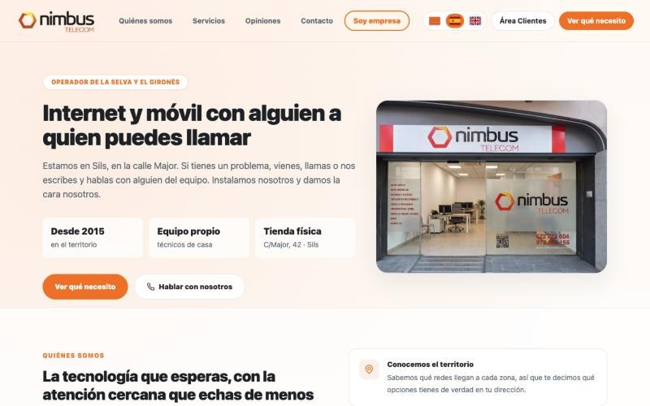

En muchas PyMEs la oficina está tan ocupada apagando fuegos que nadie tiene tiempo para vender. No es que falten ganas... es que el día se va en contraseñas que no aparecen, correos repartidos, datos que hay que copiar de un programa a otro y llamadas para preguntar cosas que ya están escritas en algún sitio.

Eso es lo que estamos cambiando en **[Nimbus Telecom](https://nimbustelecom.cat)**, un operador de internet y móvil de Sils (Girona) con el que trabajo en remoto desde Fuensalida, dentro de su equipo, en la parte de administración y operaciones. Te cuento qué hemos hecho, qué está en marcha y qué resultado se ve ya.

## El punto de partida

Nimbus es una empresa pequeña-mediana que da servicio en su zona desde 2015, con tienda física y técnicos propios. Como en casi todas las empresas que crecen poco a poco, cada herramienta llegó cuando hizo falta y nadie las ordenó después:

- Contraseñas repartidas entre personas y documentos.
- Cuentas de correo y archivos de Google Workspace sin una estructura clara.
- Varios canales de comunicación con clientes, cada uno por su lado.
- Un programa de gestión del operador (el ERP donde viven clientes, contratos e incidencias) que funciona, pero que obliga a hacer muchas tareas a mano.

El resultado: la administración ocupaba una jornada completa, o más, y hacía años que la empresa no tenía una iniciativa comercial.

## Lo que ya está hecho

**1. Las contraseñas, en un solo sitio.** Centralizamos todas las contraseñas de la empresa. Es lo primero que recomiendo siempre, porque es barato, rápido y quita un riesgo enorme. Si quieres saber cómo se hace, lo explico en [gestor de contraseñas para empresas](/gestor-contrasenas-empresas/).

**2. Google Workspace ordenado.** Cuentas, carpetas y permisos organizados para que cada persona encuentre lo suyo y la información no dependa de quién la guardó. Más detalles en [Google Workspace para empresas](/google-workspace-empresas-toledo/).

**3. Los canales de comunicación, juntos.** Unificamos los canales de comunicación dentro del propio programa de gestión, para que lo que pasa con un cliente quede en un único sitio.

**4. Web nueva con embudos por servicio.** Renovamos la web por completo y creamos un recorrido para cada servicio, conectado con el programa de gestión: la persona que pide información no se pierde en un correo. Es lo que en la web llamo [funnel web](/funnel-web/).

*La portada de la web nueva de Nimbus Telecom.*

**5. Comprobador de cobertura con IA.** Creamos una herramienta que, a partir de los datos de cobertura de los proveedores, ayuda a saber qué precios se le pueden dar a cada cliente según dónde vive. Antes eso era una consulta manual cada vez.

**6. Dos asistentes de consulta.** Uno externo, en el chat de la web, que responde a las dudas de los clientes. Y uno interno, que usamos nosotros, conectado a nuestra documentación en Notion como base de conocimiento. Lo que antes era "pregúntale a fulano", ahora se consulta.

## Lo que está en marcha

Esto todavía está en curso:

- **Una capa de inteligencia artificial por encima del programa de gestión.** La idea es que la IA haga las tareas administrativas del día a día siguiendo un manual de pasos, y que tanto el equipo como los técnicos puedan pedírselo con lenguaje normal. Todo lo que es irreversible o compromete dinero lo sigue confirmando una persona.
- **Un agente de IA para atención al cliente** por WhatsApp, teléfono y chat, que dé una primera respuesta a las incidencias. Es lo que explico en [agente de IA de atención al cliente](/agente-ia-atencion-cliente/).
- **Informes para ventas.** Cruzar la información que ya tenemos para saber, por ejemplo, qué clientes tienen fibra pero no móvil (y al revés), preparar un programa de referidos y lanzar campañas locales.
- **Números cuadrados para la gestoría.** Cruzar gastos, facturas y banco con ayuda de la IA para entregar a la asesoría los datos ya revisados, en vez de depender de integraciones entre programas que no siempre funcionan bien.

## El resultado que ya se ve

No voy a darte porcentajes que no tengo. Pero hay un dato claro: **el trabajo administrativo que antes ocupaba una jornada completa, o más, hoy lo llevo yo a media jornada**.

Y lo más importante para la empresa: **el tiempo que se libera en la oficina se puede dedicar a vender.** Lo resumieron así en la propia oficina:

> "No sé qué haríamos sin Claude."
>
> "¡Ahora podemos salir a vender!"
>
> — Equipo de Nimbus Telecom

Claude es el asistente de inteligencia artificial que usamos. Nimbus llevaba años sin iniciativa comercial y ahora está preparando campañas con la información que ya tenía guardada. Es como tener un almacén lleno de género y, por fin, alguien que abre la persiana de la tienda.

## Lo que aprendí (y te sirve aunque no seas de telecomunicaciones)

1. **Primero orden, después IA.** Las contraseñas, el Workspace y los canales no tienen nada de inteligencia artificial... pero sin eso, la IA no tiene de dónde tirar.
2. **La IA como capa, no como sustituto.** No hemos cambiado de programa de gestión. Hemos puesto la IA encima para que sea más fácil de usar. Cambiar de ERP es caro y arriesgado; muchas veces no hace falta.
3. **Lo irreversible, siempre con una persona.** La IA prepara, una persona confirma.
4. **Medir en tiempo liberado.** La pregunta no es "¿cuánta IA tenemos?", sino "¿cuántas horas de oficina podemos dedicar ahora a lo que hace crecer la empresa?".

## ¿Y en tu empresa?

Lo de Nimbus lo hago en remoto, y lo mismo se puede hacer con una empresa de Torrijos, Toledo, La Sagra o el sur de Madrid, con la ventaja de que ahí puedo pasarme en persona. Si tu oficina está desbordada y no llega a vender, empecemos por ver dónde se va el tiempo. Cuéntamelo en la página de [consultoría de digitalización](/consultor-digitalizacion-toledo/#contacto) o por WhatsApp al 632 99 01 33.
